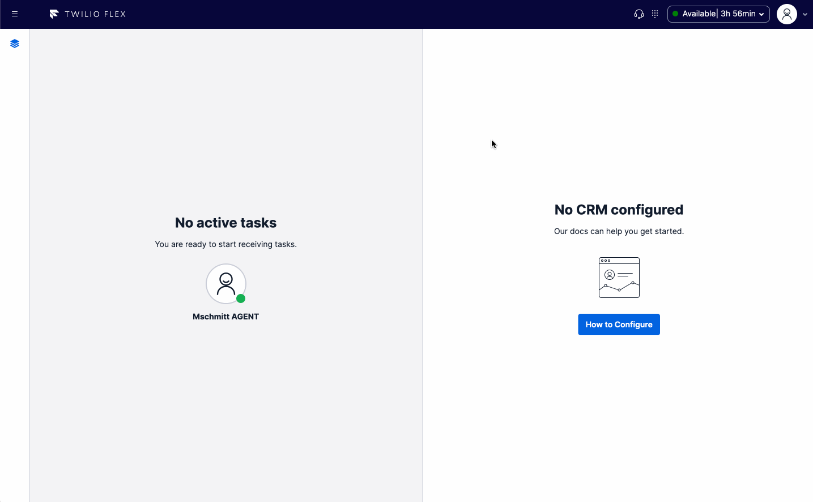

# canned-responses

The Canned Chat Responses feature helps demonstrate how Agents can select from a pre-determined list of chat responses from within the CRM panel or Message Input Actions within Flex. The canned responses are returned from a Twilio Serverless function, which is contained within the `../../../../serverless-functions/src/functions/features/canned-responses/flex/chat-responses.js` file.

The JSON object of canned responses is broken down into categories, with the various responses nested under each category. To see the raw JSON structure of the payload, please [see the file](../../../../serverless-functions//src/assets/features/canned-responses/responses.private.json) located in the `assets` folder.

# flex-user-experience

There are two options for the placement of the canned responses component within the Flex User Interface (see [Setup & Dependencies](#setup-and-dependencies) for more information).

## CRM Panel


By default, when this features is enabled within the `flex-config`, the canned responses will render in the CRM Panel on the righthand side of Flex. The responses are separated by categories, with the individual responses housing two buttons:

- `Insert` - will insert the text response into the `Input Text` component for the active task using the `SetInputText` action
- `Send` - will send the canned response into the active conversation using the `SendMessage` action

## Message Input Actions



By default, when this features is enabled within the `flex-config`, the canned responses will render in the CRM Panel on the righthand side of Flex. The responses are separated by categories, with the individual responses housing two buttons:

# setup and dependencies

## Flex Config

To enable this feature, you need to enable the feature within the `flex-config` directory for your specific environment and determine the UI placement of the responses (`CRM` or `MessageInputActions`):

```json
"canned_responses": {
    "enabled": true,
    "configuration": {
        "location": "CRM"
    }
}
```

## Populate Canned Responses

There are default examples of a canned responses payload located in [this file](../../../../serverless-functions/src/assets/features/canned-responses/responses.private.json) (also outlined below), however you will need to update these with actual canned responses that fit your use case.

```json
{
  "categories": [
    {
      "section": "Sales",
      "responses": [
        {
          "label": "Cost",
          "text": "We have multiple billing options. You can pay yearly and save 10%"
        },
        {
          "label": "Promotion",
          "text": "We do offer discounts for our best customers."
        }
      ]
    },
    {
      "section": "Support",
      "responses": [
        { "label": "Login", "text": "You can login at https://example.com" },
        {
          "label": "Forgot Password",
          "text": "You can reset your password here at https://example.com/passwordreset"
        }
      ]
    }
  ]
}
```

While this provides an example data structure of how to organize your canned responses, the UI components are implemented with this structure in mind, meaning alterations to the data structure will requrie minor tweaking within the [CannedResponsesCRM](./custom-components/CannedResponsesCRM/) and [CannedResponsesDropdown](./custom-components/CannedResponsesDropdown/) components.

# how does it work?

When enabled, this feature will call a serverless function to retrieve a JSON object of canned responses hosted within `assets`. The fetched responses are then displayed in the CRM Panel or Task Canvas based on the `configuration.location` property within the `flex-config`.

- If rendered in the CRM Panel, agents have the ability to insert the message into the active task's `Text Input`, or send the message directly into the conversation
- If rendered in the Message Input Actions, clicking a canned response will only populate the `Text Input` with the string value and not immediately send the message.

The canned responses will only appear for chat-based tasks.
