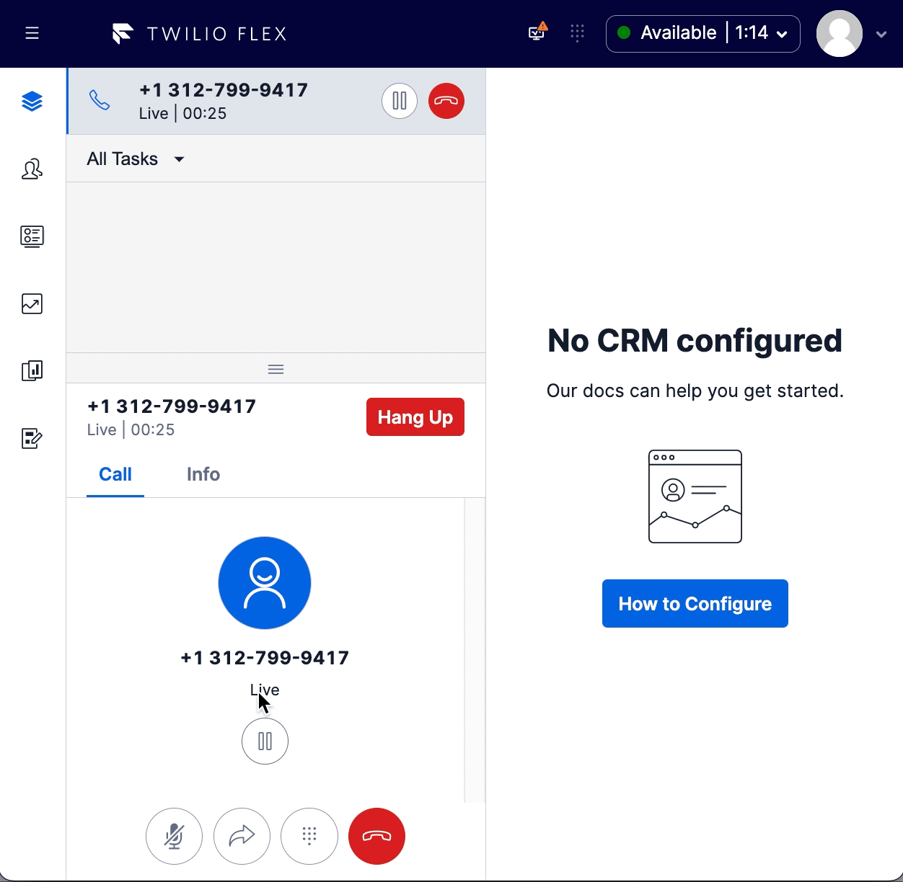

# custom-transfer-directory
This feature enables the replacement of the queue transfer directory enabling the following behavior

- queue
  - render different transfer icons for chat channel
  - enable the use of real time data to 
      - present queue insights such as # of tasks or # agents available
      - other data available such as queue wait time but further work required to show it on screen
      - filter out queues that have no agents available
  - provide an improved starting point for augmenting queue transfer list with custom data (imagine the need to filter queues based on skills required to transfer to those queues)
  - provide the ability to enforce queue filters by worker
  - provide ability to enforce global queue filter to filter out system queues.


# flex-user-experience

Example call transfer




# setup and dependencies

Enable the feature in the flex-config asset for your environment. 

``` javascript
"custom_transfer_directory": {
  "enabled": true, // globally enable or disable the feature
  "use_paste_search_icon": false, // use new paste icon or old legacy icon (recommended to use old icon if mixing with OOTB tabs for consistant look)
  "worker" : {
    "enabled": false // enable the custom worker tab - not currently developed, still to come
  },
  "queue" : {
    "enabled": true, // enable the custom queue tab
    "show_only_queues_with_available_workers": true, 
    "show_real_time_data" : true, // tool tup for queues will show real time data instead of queue name
    "enforce_queue_filter_from_worker_object": true, // when true, if `worker.attributes.enforcedQueueFilter` is present, it will be enforced, otherwise ignored
    "enforce_global_exclude_filter": false, // when true global_exclude_filter will be applied to exclude any queues matching the filter
    "global_exclude_filter": ""
  }
}
```


# how does it work?

The queue tab is replaced with the custom components using the Flex component framework.  When the component is rendered, a queues list is loaded from the taskrouter sdk and cached.  Then the insights client is used to load the real time stats for all the queues.  The real time stats are appended to each queue retrieved in the insights client and then any filters are applied.  Various events trigger a re-evaluation of the filtered list including queue updates (update, add or remove) or an entry into the search field
