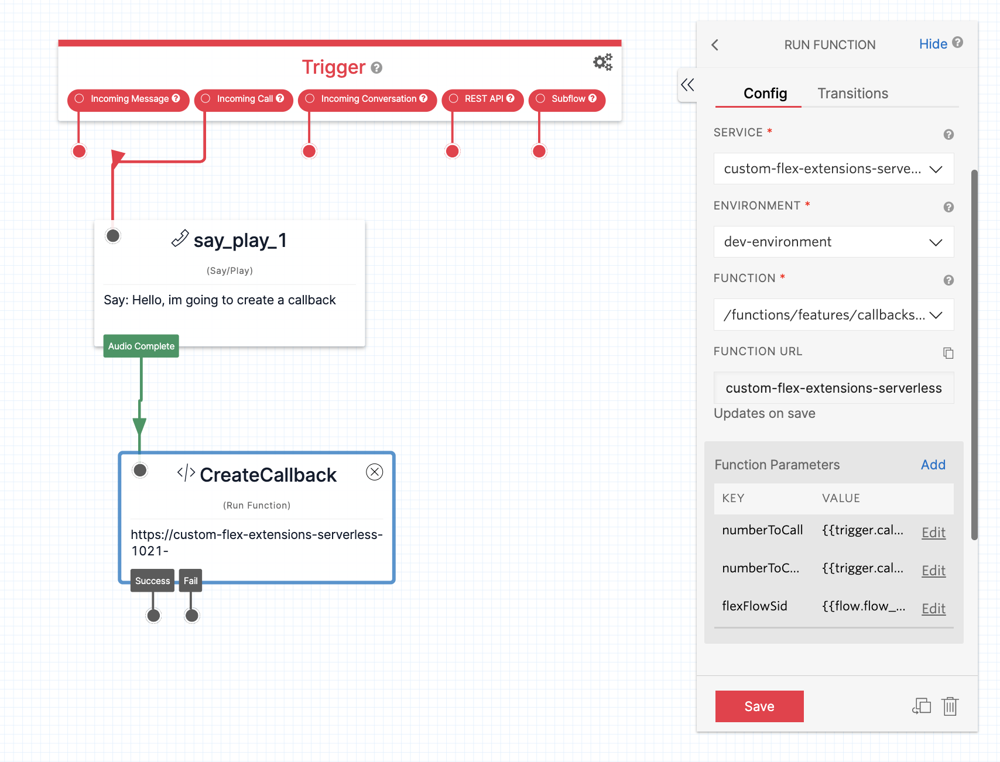

# callbacks

This feature enables the use of callbacks as a custom task type.  It is a generic version intended to accelerate the customization of such a feature for any particular project, providing the main parts of a callback feature in easy to understand and customizable way.  It is inspired by the work in the [twilio solution library](https://www.twilio.com/docs/flex/solutions-library/queued-callback-and-voicemail) however it has a few key aspects that make it a little easier to use

- the callbacks are placed on the voice channel by default, as its typical projects want callbacks to be threaded in single file with voice calls.
- there is an API for creating the callback so you just have to create your customer experience then decide when to create the callback instead of peeling apart the sample solution.
- [creating a callback](../../../../serverless-functions/src/functions/features/callbacks/studio/create-callback.protected.js#L68) has a little more resiliency built in as it uses a retry handler.

# flex-user-experience

the vanilla feature without any further customizations will look like this

# setup and dependencies

Creating a callback involves creating a task with at a minimum a number to callback and a number to call from.  A sample setup of that is shown here in a studio flow where a number has been wired up to immediately create a callback and hang up.

here you can see three parameters which are populated from the studio flow

- numberToCallTo: {{trigger.flow.From}} - the number the customer dialed from
- numberToCallFrom: {{trigger.flow.To}} - the number the customer tried to dial
- flexFlowSid: {{flex.flex_flow}} - to capture the entry point of this callback, it is stored on the task

This serverless function can be used from anywhere, not just the studio flow, to create a callback task.

The creation of a task requires a workflow.  You may create a custom workflow, that uses some collected data to organize the tasks into different queues or maybe something more complex.  You may also just want to use the default "Assign To Anyone" workflow that is spawned on a vanilla flex instance.

Once you have decided which workflow you are using, you simply reference it in the environment file for your serverless-functions and make sure it is deployed as well as ensuring the flag is set for the feature in flex-config and that, that is also deployed.  You now have a functioning callback feature!

the variable that you need to make sure is set is
>TWILIO_FLEX_CALLBACK_WORKFLOW_SID=WW....
